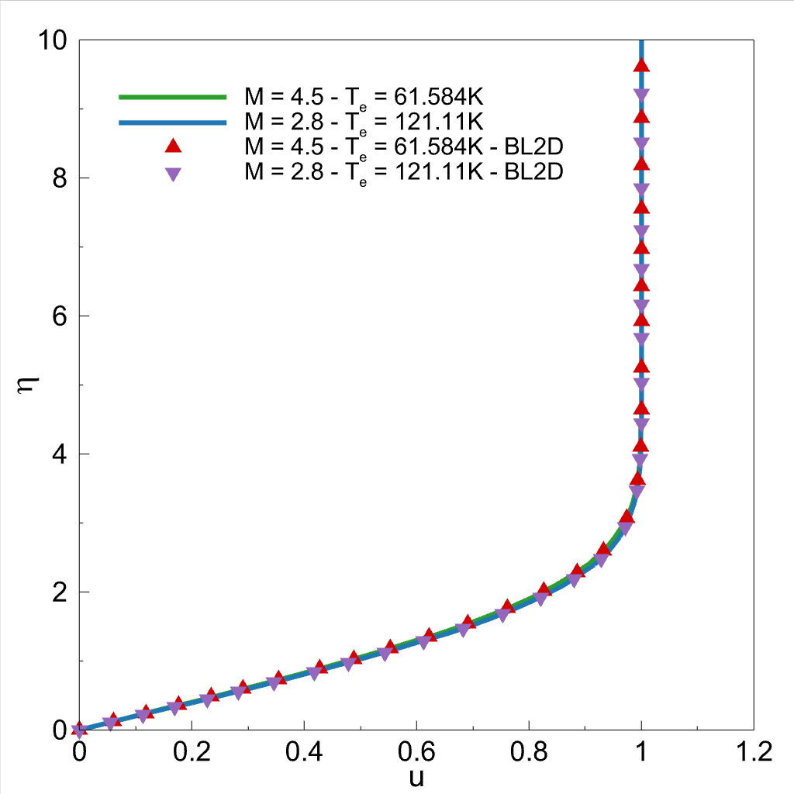
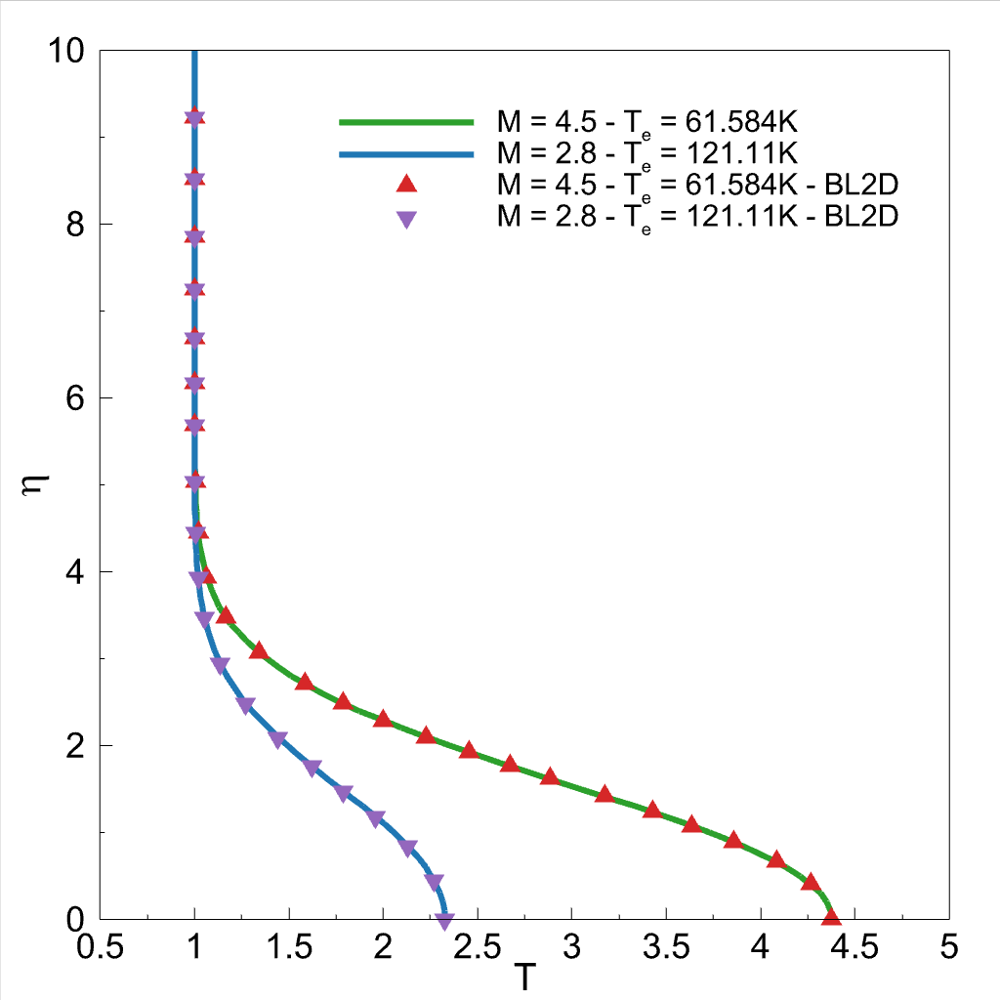

# A CFD Tutorial in Julia: Compressible Blasius
A CFD Tutorial in Julia: Introduction to Compressible Laminar Boundary-Layer Theory journal's code repository. The codes are developed in the Computational Hypersonics and Aerodynamics Laboratory.

## **Abstract**
A boundary-layer is a thin fluid layer near a solid surface, and viscous effects dominate it. The laminar boundary-layer calculations appear in many aerodynamics problems including, skin friction drag, flow separation, and aerodynamic heating. A student must understand the flow physics and the numerical implementation to conduct successful simulations in advanced undergraduate- and graduate-level fluid dynamics/aerodynamics courses. Numerical simulations require writing computer codes. Therefore, choosing a fast and user-friendly programming language is essential to reduce code development and simulation times. Julia is a new programming language that combines performance and productivity. The present study derived the compressible Blasius equations from Navier-Stokes' equations and numerically solved the resulting equations using the Julia programming language. The fourth-order Runge-Kutta method is used for the numerical discretization, and Newton's iteration method is employed to calculate the missing boundary condition. In addition, Burgers', heat, and compressible Blasius equations are solved both in Julia and MATLAB. The runtime comparison showed that Julia with $for$ loops is 2.8 to 50 times faster than MATLAB in 4 out of 5 cases. We also released the Julia codes on our GitHub page to shorten the learning curve for interested readers.

#### **Oz, F.; Kara, K. A CFD Tutorial in Julia: Introduction to Compressible Laminar Boundary-Layer Theory. Fluids, 2021, **_Under review_**.**

#### **Instructions**

Julia setup files can be downloaded from their website (https://julialang.org/downloads/). The website also includes instructions on how to install Julia on Windows, Linux, and mac operating systems. It is common to use external packages for Julia. In order to do that, Pkg, which is Julia's built-in package manager, can be used. Once Julia is opened, Pkg can be activated with the "]" button in Windows. In Linux, calling "julia" in the terminal will open it. After that "Pkg.add("Pluto")" will trigger the setup process for that package. In here, we used Pluto as an example because, in GitHub, our codes are developed in the Pluto environment. After Pluto is installed. Pluto can be run with "Pluto.run()". This command will open a new tab in the browser which you can run your Julia codes. After that, the "using Pluto" line must be placed to the top of the file. For "Plots" package, the commands will be "Pkg.add("Plots")" and "using Plots". Since the Plots package does not have a GUI, there is not a command called "Plots.run()".

## **Compressible Blasius Equations**
Boundary-layer velocity and temperature profiles on the flat plate can be projected onto single profile wich is self-similar profile. It can be represented using the ordinary differential equations (ODEs) below:

\begin{equation}
(cf'')'+ff'' =0
\end{equation}
$$(a_1g'+a_2f'f'')'+fg'=0$$
    
where 

$$f'=\frac{u}{u_e}$$
$$c=\frac{\rho \mu}{\rho_e \mu_e}$$
$$g=\frac{H}{H_e}$$ 
$$a_1=\frac{c}{\sigma}$$
$$a_2=\frac{(\gamma-1)M^2}{1+(\frac{\gamma-1}{2})M^2}\left(1-\frac{1}{\sigma}\right)c$$

and H is the enthalpy, γ is the ratio of specific heats, M is the edge Mach number, and σ is the Prandtl number. σ and M can be defined as

$$M=\frac{u_e}{\sqrt{\gamma \mathfrak{R}T_e}}$$
$$\sigma=\frac{\mu c_p}{k}$$
    
In this code, σ is assumed as 0.72. The viscosity μ is a function of T and it is calculated as

$$μ = c₁\frac{T^{3/2}}{(T+c₂)}$$

c₂ is 110.4 Kelvin. c₁ is disappearing on the nondimensionalizing process. The boundary conditions for the system of ODEs are
    
$$y=0;  f=f'=0$$
$$y\rightarrow \infty;  f',g \rightarrow 0$$

The resultant equations along with the boundary conditions are solved with the Runge-Kutta scheme with Newton's iteration method for the missing boundary condition.

The solution vector is ploted and compared with results from Schlichting's Boundary-layer theory book.

Details of RK:
Numerical Recipes, Cambridge

Details of Similarity solution formulation:
Boundary-Layer Theory, 7ᵗʰ edition, Schlichting

Feel free to ask questions!

## **Please read the full paper for further details.**

Feel free to ask questions!

*Furkan Oz*  
[foz@okstate.edu](foz@okstate.edu)  
  
*Kursat Kara*  
[kursat.kara@okstate.edu](kursat.kara@okstate.edu)  

